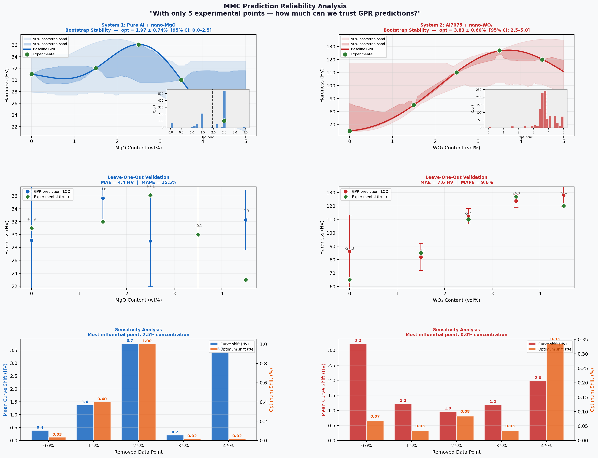

# MMC Prediction Reliability Analysis

> **Central question:** With only 5 experimental data points per system, how much can we trust GPR predictions — and which data points matter most?

This project is a rigorous reliability companion to [mmc-gpr-optimizer](https://github.com/enganmardhaif-oss/mmc-gpr-optimizer). While the first project asks *"what does the model predict?"*, this one asks *"how confident should we be in those predictions?"*

---

## Motivation

In experimental materials science, data is expensive. Each data point requires fabricating a composite, sintering it, and running mechanical tests — often weeks of work. Both systems studied here have only **5 experimental observations**.

This raises a critical question before trusting any model output:

> *Is the predicted optimum a genuine property of the material system — or an artifact of our small dataset?*

---

## Three Analyses

### 1. Bootstrap Stability (1,000 iterations)
Repeatedly resamples the 5 data points with replacement and rebuilds the GPR model each time. Reveals how stable the predicted optimum is under data perturbation.

| System | Bootstrap Optimum | 95% Confidence Interval |
|--------|-------------------|------------------------|
| Pure Al + MgO | 1.97 ± 0.74 wt% | [0.00 – 2.54 wt%] |
| Al7075 + WO₃ | 3.83 ± 0.60 vol% | [2.51 – 5.00 vol%] |

**Finding:** The WO₃ system shows higher stability (smaller std). The MgO system has wider uncertainty — expected given the sharper, narrower optimum peak.

---

### 2. Leave-One-Out (LOO) Cross-Validation
Removes one data point, trains on the remaining 4, and predicts the removed point. Measures how well the model generalizes to unseen data.

| System | MAE | MAPE | Verdict |
|--------|-----|------|---------|
| Pure Al + MgO | 4.40 HV | 15.5% | MODERATE |
| Al7075 + WO₃  | 7.63 HV | 9.6%  | HIGH     |

**Finding:** Despite having only 5 data points, the WO₃ system achieves <10% prediction error on unseen points — a strong signal that the GPR is capturing real physics, not noise.

---

### 3. Sensitivity Analysis
Removes each data point one at a time and measures how much the prediction curve and optimum location shift. Identifies which single experiment carries the most information.

**Key findings:**
- **MgO system:** The 2.5 wt% point (the optimum itself) is most influential — removing it shifts the curve by 3.75 HV
- **WO₃ system:** The 0 vol% baseline point is most influential — it anchors the entire model

**Implication:** If we could run one more experiment, these analyses tell us *exactly where* it would be most valuable.

---

## Master Figure



---

## Key Research Insight

```
Both systems have 5 data points.
WO₃ system: HIGH reliability   → wider hardness range, clearer signal
MgO system: MODERATE reliability → narrower hardness range, noisier signal
```

This difference is not a modeling failure — it reflects genuine differences in how sharply the two material systems respond to reinforcement content.

**The deeper question:** Can we design experiments *actively* to maximize information gain with minimal trials? This is the domain of **Bayesian Experimental Design (BED)** — a natural bridge toward the Offline RL framework where sequential decisions must be made under uncertainty.

---

## Connection to Research Roadmap

```
Project 1 (mmc-gpr-optimizer)
  → GPR predicts optimal concentration
  → Physics constraints via Archard's Law
        ↓
Project 2 (this project)
  → Quantifies trust in those predictions
  → Identifies most informative experiments
        ↓
PhD Proposal
  → Offline RL to prescribe optimal manufacturing sequences
  → Bayesian Experimental Design to minimize physical trials
```

---

## Repository Structure

```
mmc-prediction-reliability/
├── README.md
├── data/
│   ├── mgo_system.csv         ← Pure Al + nano-MgO
│   └── wo3_system.csv         ← Al7075 + nano-WO₃
├── notebooks/
│   └── reliability_analysis.py  ← Bootstrap + LOO + Sensitivity
└── results/
    └── figures/
        └── reliability_analysis.png
```

---

## Publications (Data Sources)

1. Irhayyim SS, Hammood HS, **Mahdi AD** (2020). *Mechanical and wear properties of hybrid aluminum matrix composite reinforced with graphite and nano MgO particles.* AIMS Materials Science, 7(1): 103–115.

2. **Mahdi AD**, Irhayyim SS, Abduljabbar SF (2020). *Mechanical and Wear Behavior of Al7075-Graphite Self-Lubricating Composite Reinforced by Nano-WO₃ Particles.* Materials Science Forum, Vol. 1002, pp. 151–160.

---

## Requirements

```
numpy  pandas  scikit-learn  matplotlib
```

```bash
pip install numpy pandas scikit-learn matplotlib
python notebooks/reliability_analysis.py
```

